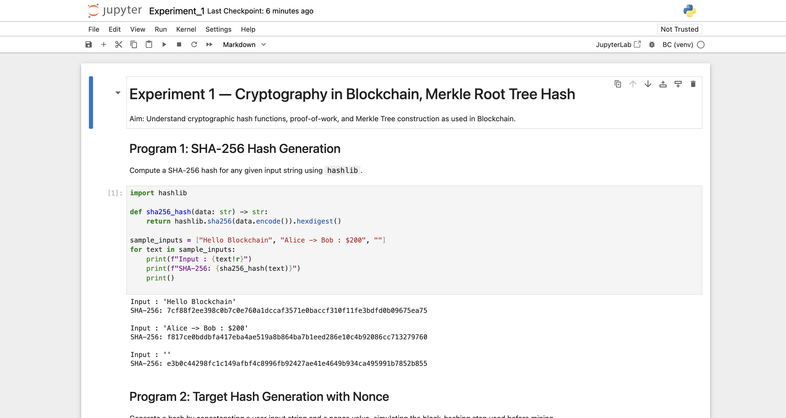
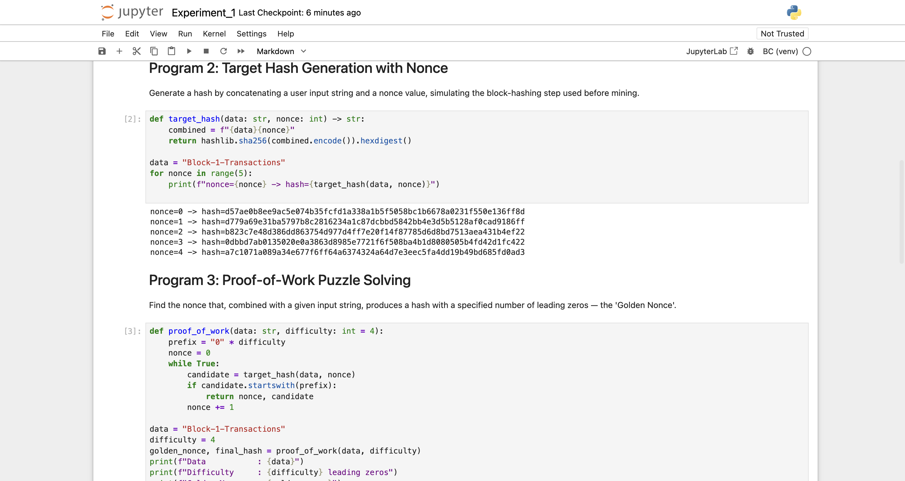
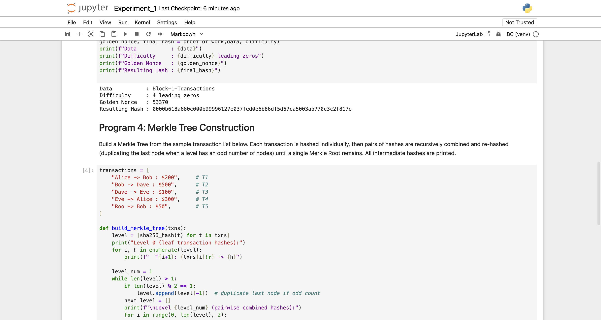
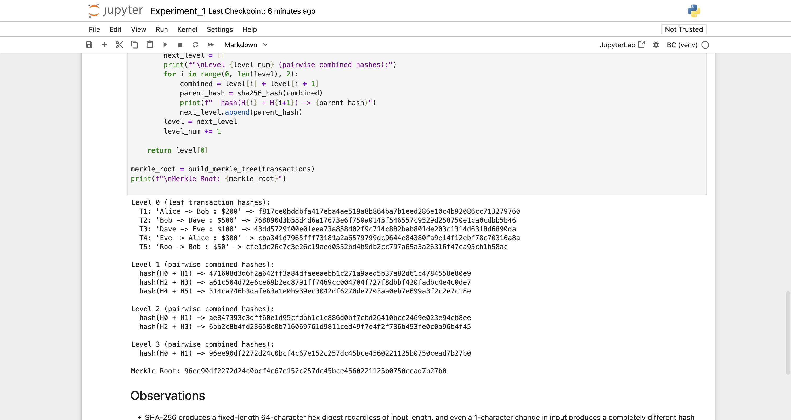
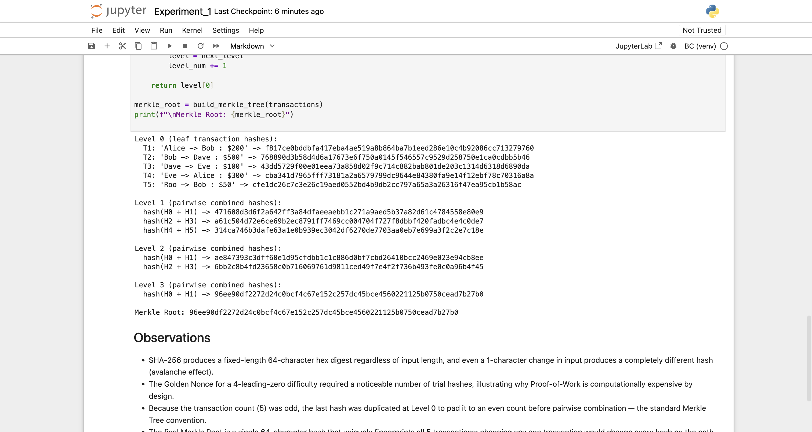

# Experiment 1

## Cryptography in Blockchain, Merkle Root Tree Hash

## Aim

To understand cryptographic hash functions, Proof-of-Work, and Merkle Tree construction as used in Blockchain, by implementing SHA-256 hashing, a nonce-based target hash, a Proof-of-Work puzzle solver, and a Merkle Tree over a sample set of transactions.

## Theory

A cryptographic hash function such as SHA-256 maps an input of any length to a fixed-size (256-bit) digest that is deterministic, fast to compute in the forward direction, and infeasible to invert or find collisions for. Blockchain systems rely on this to fingerprint blocks and transactions: even a one-character change in the input produces a completely different, unpredictable hash (the avalanche effect).

Proof-of-Work is the mechanism Bitcoin-style blockchains use to make adding a new block computationally expensive. A miner repeatedly hashes a combination of the block's data and a changing **nonce** until the resulting hash satisfies a difficulty target — conventionally, a required number of leading zero bits/hex digits. The nonce that first satisfies this target is called the **Golden Nonce**. Because SHA-256 output is effectively random with respect to its input, the only way to find a qualifying nonce is brute-force search, and the expected number of attempts grows exponentially with the difficulty (number of required leading zeros).

A **Merkle Tree** is a binary tree of hashes used to efficiently and verifiably summarize a set of transactions. Each transaction is hashed individually (the leaves); pairs of hashes are then concatenated and re-hashed to form the parent level, repeating until a single hash — the **Merkle Root** — remains. When a level has an odd number of nodes, the last node is duplicated so it can still be paired. The Merkle Root is stored in the block header: it lets a node verify that a specific transaction belongs to a block using only a small number of intermediate hashes (a Merkle proof), without downloading every transaction in the block.

**Tools used:** Python 3.12, the standard `hashlib` library, run in a local Jupyter Notebook (`Experiment_1.ipynb`, in this folder).

## Output

*Program 1: SHA-256 digests computed for three sample inputs, including the empty string, each producing a distinct 64-character hex digest.*

*Program 2: hash of `data + nonce` for nonce 0–4, showing how the hash changes unpredictably with the nonce. Program 3 (Proof-of-Work) begins below it.*

*Program 3 result: the Golden Nonce (53370) found for a 4-leading-zero difficulty, and the resulting hash `0000b618a680...`. Program 4 (Merkle Tree) begins with the 5 sample transactions.*

*Program 4: Level 0 leaf hashes for all 5 transactions, followed by Levels 1–3 pairwise-combined hashes as the tree is built upward.*

*The completed Merkle Tree: Level 3 produces the single Merkle Root `96ee90df...`, followed by the written observations.*

## Conclusion

This experiment implemented the four core cryptographic building blocks of a blockchain from scratch: SHA-256 hashing, nonce-based target hashing, Proof-of-Work puzzle solving, and Merkle Tree construction. Finding the Golden Nonce for a 4-leading-zero difficulty took 53,370 trial hashes, concretely demonstrating why Proof-of-Work is computationally expensive by design and why difficulty (the number of required leading zeros) directly controls how much work mining requires. Building the Merkle Tree over the 5 sample transactions — hashing each transaction, duplicating the last leaf to handle the odd count, and recursively combining pairs — produced a single Merkle Root that uniquely fingerprints the entire transaction set, illustrating how a blockchain can compactly and verifiably summarize an arbitrarily large batch of transactions in one 64-character hash.
