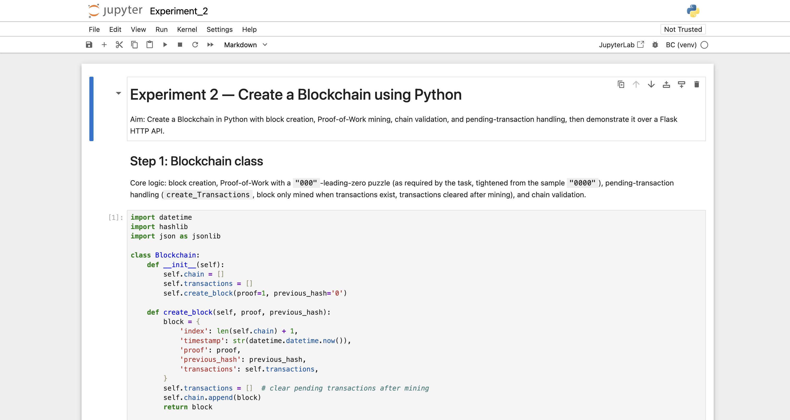
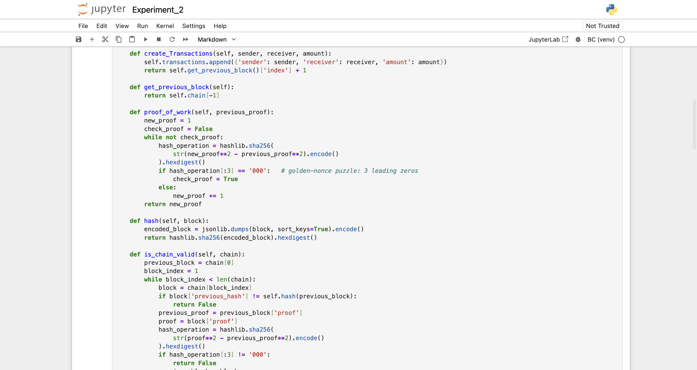
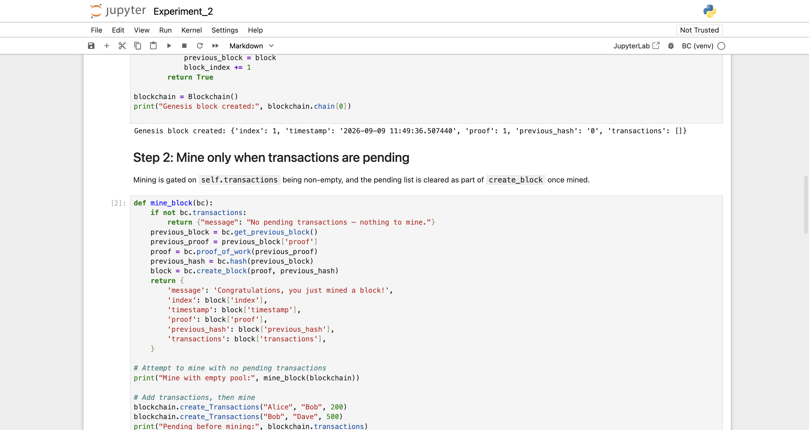
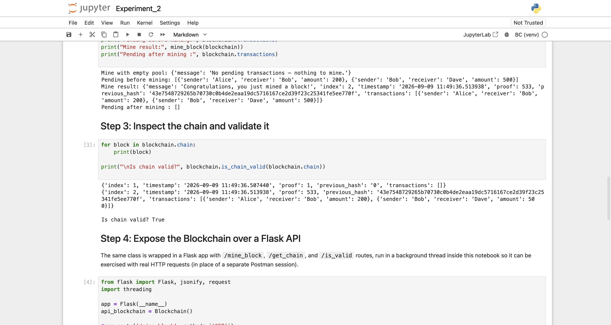
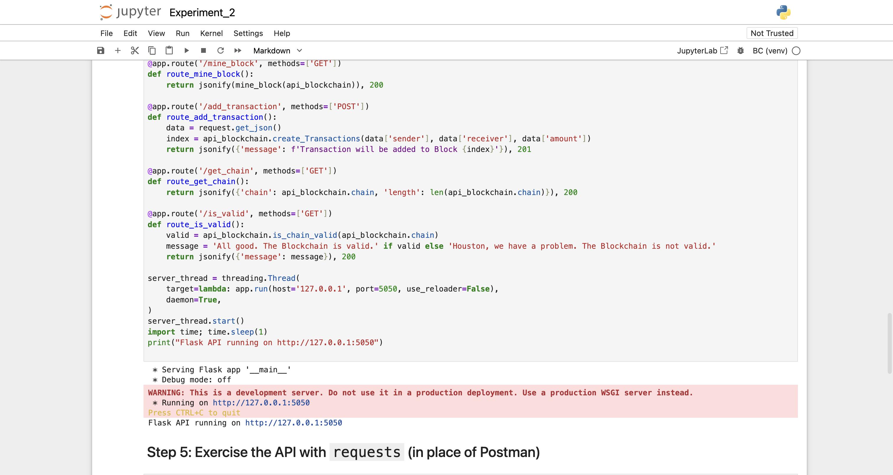
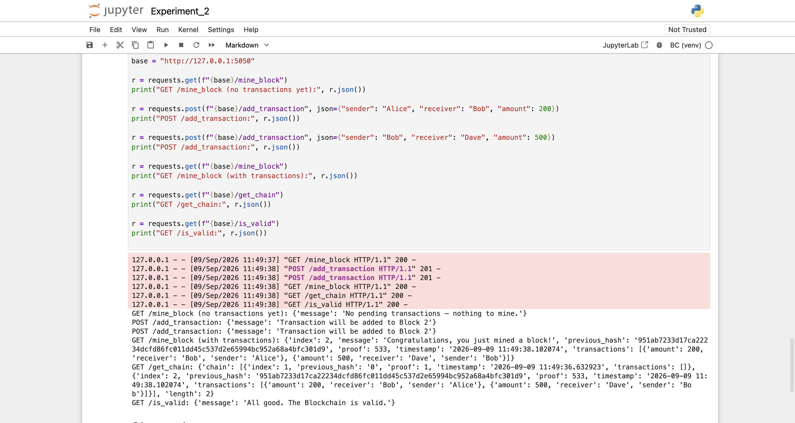

# Experiment 2

## Create a Blockchain using Python

## Aim

To create a Blockchain in Python with block creation, Proof-of-Work mining, chain validation, and pending-transaction handling, and to demonstrate its working over a Flask HTTP API.

## Theory

A blockchain is a distributed, append-only ledger made of blocks linked by hash: each block stores an index, a timestamp, a Proof-of-Work value, the hash of the previous block, and the transactions it contains. Linking blocks by the previous block's hash is what makes the chain tamper-evident — changing any historical block changes its hash, which breaks every `previous_hash` reference after it.

Building on Experiment 1's Proof-of-Work primitive, this experiment wraps it in a full `Blockchain` class with three additional behaviors required by the task: (1) a `create_Transactions` method that queues transactions instead of writing them straight into a block, (2) mining that is gated on the pending-transaction pool being non-empty, so no Proof-of-Work is wasted mining an empty block, and (3) the pending pool being cleared as part of `create_block`, so a mined transaction cannot be mined again. The Proof-of-Work target was also tightened from the sample `"0000"` (4 leading zeros) to the task-specified `"000"` (3 leading zeros), which lowers the average number of nonce trials needed per block.

The same `Blockchain` class is then exposed over HTTP with Flask, using `/mine_block`, `/add_transaction`, `/get_chain`, and `/is_valid` routes — the same interface a Postman session would exercise, driven here instead with Python's `requests` library so the whole demonstration is reproducible from one notebook run.

**Tools used:** Python 3.12, `hashlib`, `datetime`, Flask, `requests`, run in a local Jupyter Notebook (`Experiment_2.ipynb`, in this folder) with the Flask server running in a background thread in place of a separate terminal + Postman session.

## Output

*Step 1: the `Blockchain` class with `create_block`, `create_Transactions`, `proof_of_work` (3-leading-zero target), `hash`, and `is_chain_valid`.*

*Continuation of Step 1: the full `proof_of_work`, `hash`, and `is_chain_valid` methods, ending with the genesis block being created.*

*Step 2: `mine_block` refuses to mine when the transaction pool is empty, then successfully mines a block once 2 transactions are queued — the pool is empty again immediately after.*

*Step 3: both blocks printed and the chain confirmed valid. Step 4 begins: the same Blockchain wrapped in a Flask app with `/mine_block`, `/add_transaction`, `/get_chain`, `/is_valid` routes.*

*The four Flask routes and the background server thread starting successfully on `http://127.0.0.1:5050`.*

*Step 5: the API driven with `requests` — mining with no transactions returns "nothing to mine", two transactions are POSTed, then mining succeeds and `/get_chain` and `/is_valid` confirm a 2-block valid chain, mirroring exactly what Postman would show.*

## Conclusion

This experiment built a complete, working Blockchain in Python and exposed it as a real HTTP service. Tightening the Proof-of-Work target from 4 to 3 leading zeros (`"000"`) visibly reduced the mining difficulty — the golden-nonce search in this run resolved in 533 attempts versus the tens of thousands seen for a 4-zero target in Experiment 1. Gating `mine_block` on a non-empty transaction pool and clearing that pool inside `create_block` together prevent both wasted mining (on empty blocks) and double-mining (of the same transactions). Finally, driving the Flask `/mine_block`, `/add_transaction`, `/get_chain`, and `/is_valid` endpoints with the `requests` library reproduced exactly what a Postman session would show — confirming the chain stayed valid (`is_chain_valid` returned `True`) after mining — while keeping the whole demonstration self-contained and reproducible in one notebook run.
