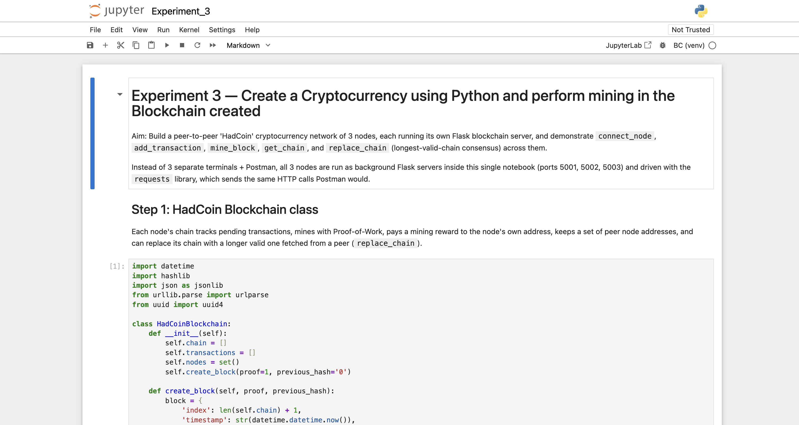
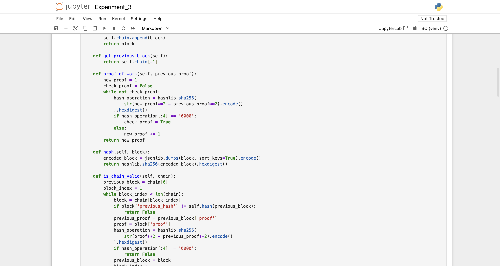
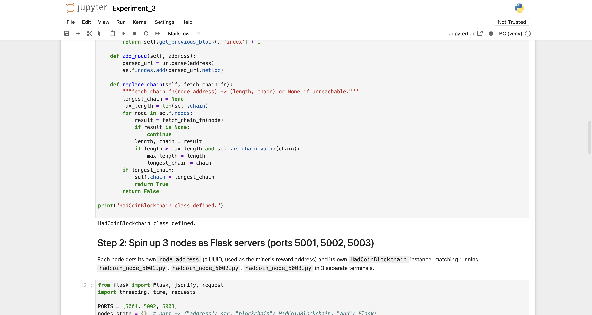
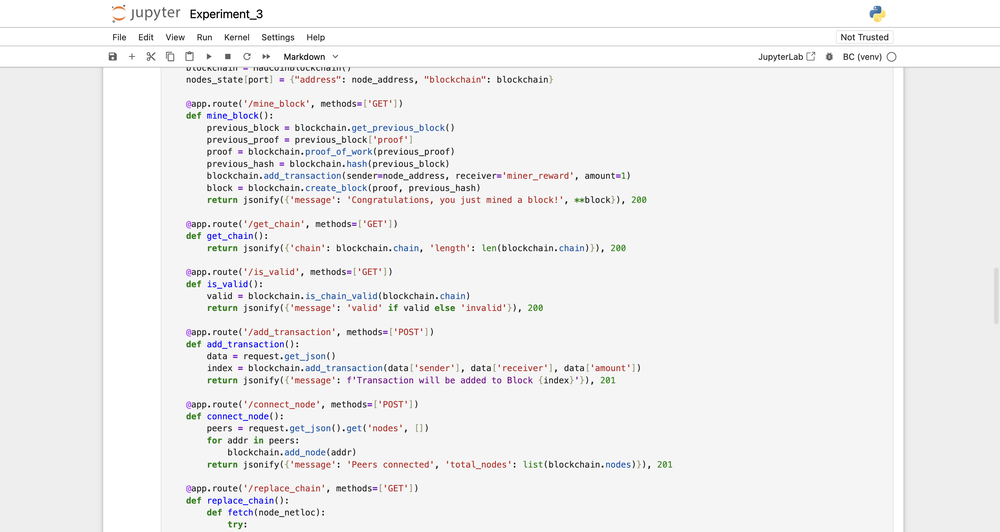
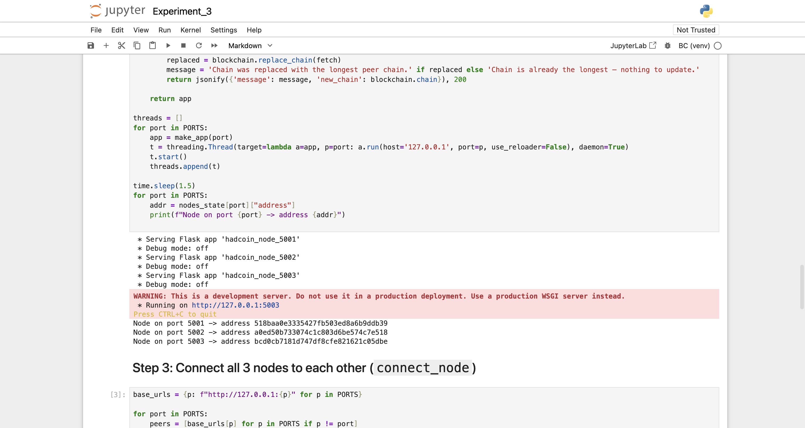
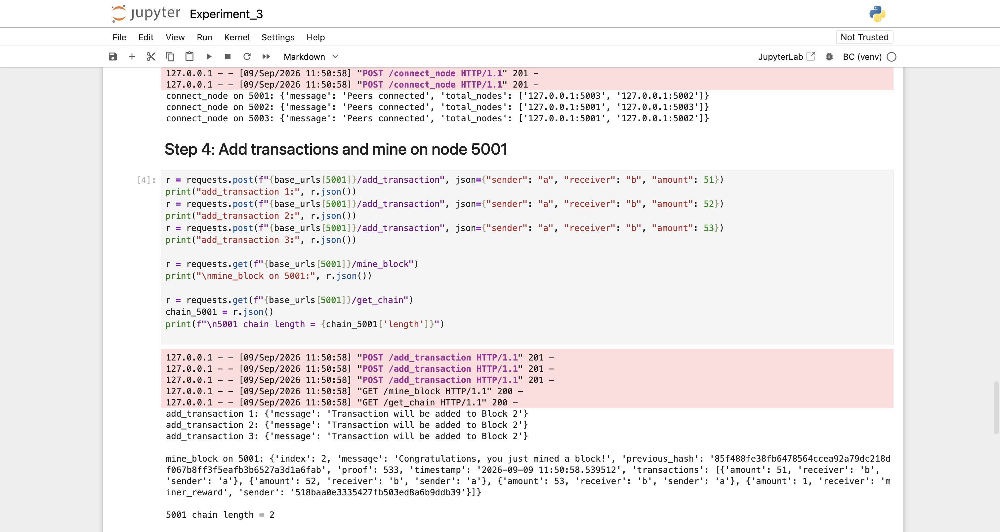
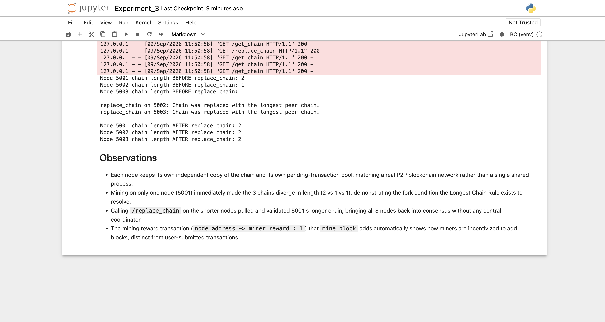

# Experiment 3

## Create a Cryptocurrency using Python and perform mining in the Blockchain created

## Aim

To create a peer-to-peer cryptocurrency ("HadCoin") using Python and demonstrate mining, transaction propagation, and multi-node consensus across a 3-node Blockchain network.

## Theory

A real cryptocurrency network is not one blockchain process but many independent nodes, each holding its own copy of the chain and its own pool of pending transactions, communicating over HTTP. This experiment extends Experiment 2's `Blockchain` class into a `HadCoinBlockchain` used by 3 separate Flask nodes (ports 5001, 5002, 5003), each identified by a UUID `node_address` used as its mining-reward address.

Each node exposes `connect_node` (register peer addresses), `add_transaction` (queue a transaction), `mine_block` (run Proof-of-Work, automatically append a mining-reward transaction to the node's own address, and append the new block), `get_chain` (return the node's current chain), and `replace_chain`. The last of these implements the **Longest Chain Rule**, the consensus mechanism that resolves forks in a P2P blockchain network without a central coordinator: a node asks every known peer for its chain, and if any peer's chain is both longer and valid, the node adopts it in place of its own. This is essential because independent mining on different nodes inevitably produces temporarily divergent chains, and the network needs a deterministic rule for which version "wins".

Rather than running `hadcoin_node_5001.py`, `hadcoin_node_5002.py`, `hadcoin_node_5003.py` in 3 separate terminals with a manual Postman session, all 3 Flask servers are run as background threads inside one notebook and driven with the `requests` library, which issues the exact same HTTP calls Postman would.

**Tools used:** Python 3.12, `hashlib`, `datetime`, `uuid`, `urllib.parse`, Flask, `requests`, run in a local Jupyter Notebook (`Experiment_3.ipynb`, in this folder).

## Output

*Step 1 (start): the `HadCoinBlockchain` class — `create_block`, `get_previous_block`, and the start of `proof_of_work`, tracking `chain`, `transactions`, and `nodes` per instance.*

*Continuation of Step 1: `proof_of_work` (4-leading-zero target), `hash`, and `is_chain_valid`.*

*Continuation of Step 1: `add_node` registers a peer's address, and `replace_chain` implements the Longest Chain Rule — adopting the longest valid chain found among peers.*

*Step 2: `mine_block`, `get_chain`, `is_valid`, `add_transaction`, and `connect_node` routes defined per-node, each backed by its own `HadCoinBlockchain` instance and `node_address`.*

*The `replace_chain` route (using the Longest Chain Rule from Step 1) completes the Flask app, and all 3 nodes (5001, 5002, 5003) start successfully, each printing its own generated `node_address`.*

*Step 3: all 3 nodes register each other as peers via `connect_node`. Step 4: 3 transactions are queued and mined on node 5001 alone — the mined block includes a mining-reward transaction to 5001's own address, and its chain grows to length 2 while 5002/5003 remain at length 1.*

*Step 5: chain lengths diverge (5001=2, 5002=1, 5003=1) before `replace_chain`; calling it on 5002 and 5003 pulls 5001's longer chain, bringing all 3 nodes to length 2 — followed by the written observations.*

## Conclusion

This experiment built a genuine 3-node peer-to-peer cryptocurrency network and demonstrated the exact failure mode — and its resolution — that P2P blockchains are designed around. Mining on only one node (5001) immediately produced divergent chain lengths across the network (2 vs. 1 vs. 1), because each node had only its own local view of the chain. Calling `/replace_chain` on the two shorter nodes resolved this without any central coordinator: each node independently fetched peer chains, validated them, and adopted 5001's longer chain, bringing all three back into consensus at length 2. The automatic mining-reward transaction (`node_address -> miner_reward : 1`) added inside `mine_block` further illustrates the economic incentive that drives miners to extend the chain, distinct from the user-submitted transactions being settled.
